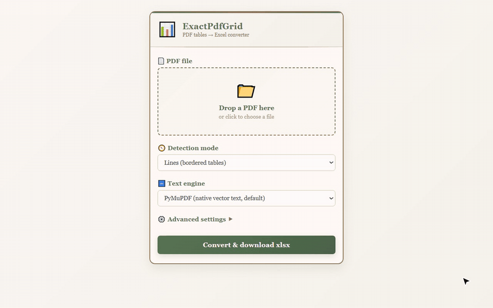

# 作品展示

履歷中各專案的實際操作畫面。

---

## PDF 表格轉 Excel 開源工具

**ExactPdfGrid**｜2026.04 – 2026.07｜[原始碼](https://github.com/cowrider2018/ExactPdfGrid) · [PyPI](https://pypi.org/project/exactpdfgrid/)

把 PDF 裡的表格自動轉成 Excel，連合併儲存格都能還原；已公開發佈 4 個版本，任何人都能免費安裝使用。

`Python` `OpenCV` `OCR` `Flask` `GitHub Actions`

**有框線表格**：上傳 PDF → 偵測格線 → 輸出 Excel

**無框線表格**：以空白區域推算格線，輸出相同結構

---

## 網頁影音下載工具

**Chrome 擴充功能 Video Downloader**｜2026.09｜[原始碼](https://github.com/cowrider2018/video-downloader)

瀏覽器外掛，自動找出網頁上的影片、音訊與圖片，一鍵加入下載清單。

`JavaScript` `Chrome Extension` `串流影音格式處理`

**偵測與下載**：自動偵測頁面影音並加入下載佇列

---

## 飾品電商網站

**Maisie（6 人團隊期末專案）**｜2024.05 ／ 2026.07｜[原始碼](https://github.com/cowrider2018/cyim-web-programming-final) · [線上展示](https://cowrider2018.github.io/cyim-web-programming-final)

完整的購物網站，包含商品瀏覽、購物車、結帳、訂單與後台管理。團隊專案中負責全部後端，之後獨立重寫全部前端。

`React` `TypeScript` `Express` `SQL`

**購物流程**：瀏覽商品 → 加入購物車 → 結帳

**後台管理**：商品與訂單管理

---

## 路口車流量自動計數

**CCTV_CarCounter**｜2026.05 – 2026.06｜[原始碼](https://github.com/cowrider2018/CCTV_CarCounter)

從路口監視器影像中自動辨識並追蹤每一台車，分別統計通過指定路段的汽車、機車與卡車數量。

`Python` `YOLO 物件偵測` `ByteTrack 追蹤` `OpenCV` `SQLite`

**車流計數**：高公局公開 CCTV（環北交流道）實際錄影，2 倍速；青色線為計數線，左上為各車種累計數量

